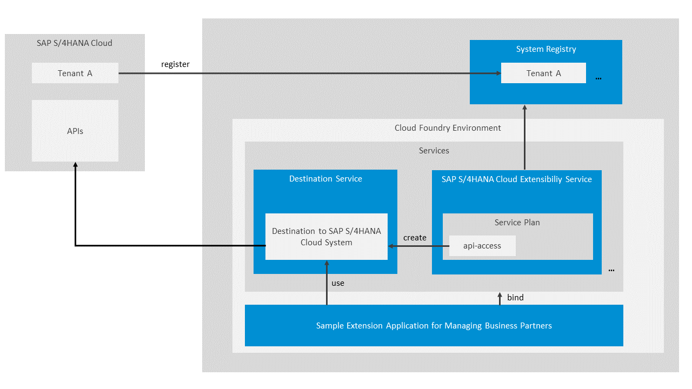

# Business Partner Sample Application for SAP S/4HANA Cloud

[](https://api.reuse.software/info/github.com/SAP/business-partner-sample-app-s4hana-cloud)

## Introduction

You can extend the functionality of your SAP S/4HANA Cloud system to manage your business partners. To do that, you can use the **business partner sample application for SAP S/4HANA Cloud**, deploy it in a subaccount in SAP Business Technology Platform (SAP BTP) but have it fully integrated in your SAP S/4HANA Cloud system. Using this application, you can:
* View a list of all your business partners
* Add new business partners



## Prerequisites

There are several components and authorizations that you and/or your team members need.

**Tools**

* [JDK 7 or later](http://www.oracle.com/technetwork/java/javase/downloads/jre7-downloads-1880261.html)
* [Maven 3.0.x](http://maven.apache.org/docs/3.0.5/release-notes.html)
* [Cloud Foundry Command Line Interface (cf CLI)](https://help.sap.com/viewer/65de2977205c403bbc107264b8eccf4b/Cloud/en-US/4ef907afb1254e8286882a2bdef0edf4.html?q=cf%20CLI)
* [git](https://git-scm.com/download/)

**On SAP BTP side:**

* You have either an [enterprise](https://help.sap.com/viewer/65de2977205c403bbc107264b8eccf4b/Cloud/en-US/171511cc425c4e079d0684936486eee6.html) or a [trial](https://help.sap.com/viewer/65de2977205c403bbc107264b8eccf4b/Cloud/en-US/046f127f2a614438b616ccfc575fdb16.html) global account in SAP BTP.
* You have an S-user or P-user (if you are using an enterprise global account), and a trial user (if you are using a trial account). See [User and Member Management](https://help.sap.com/viewer/65de2977205c403bbc107264b8eccf4b/Cloud/en-US/cc1c676b43904066abb2a4838cbd0c37.html?q=user).
* You are an administrator of the global account where you want to register your SAP S/4HANA Cloud system.
* You have enabled the Cloud Foundry capabilities for your subaccount in SAP BTP.
* Check which feature set you are using. See [Cloud Management Tools — Feature Set Overview](https://help.sap.com/viewer/65de2977205c403bbc107264b8eccf4b/Cloud/en-US/caf4e4e23aef4666ad8f125af393dfb2.html?q=feature%20set).

**On SAP S/4HANA Cloud side:**

* You have a dedicated SAP S/4HANA Cloud tenant with an Identity Authentication tenant configured. You need to use the same Identity Authentication tenant for your subaccount in SAP BTP.
* To configure the integration on the SAP S/4HANA Cloud system side, you need a business user with the roles: 

   * SAP_BR_ADMINISTRATOR that contains the Business Catalog SAP_CORE_BC_COM necessary to access and administer the SAP S/4HANA Cloud tenant.
   * SAP_BR_BPC_EXPERT to be able to maintain the event topics in the SAP S/4HANA Cloud tenant.

You can check whether your user has the required roles via the Maintain Business Users application in your SAP S/4HANA Cloud tenant. See [Maintain Business Roles](https://help.sap.com/viewer/55a7cb346519450cb9e6d21c1ecd6ec1/2102.500/en-US/8980ad05330b4585ab96a8e09cef4688.html).

## Process

### 1. Connect the SAP S/4HANA Cloud system you want to extend with the corresponding global account in SAP BTP

To do that, you must register your SAP S/4HANA Cloud system in your global account in SAP BTP. During this process, an integration token is created and then used by the SAP S/4HANA Cloud system tenant administrator to configure the integration on the SAP S/4HANA Cloud system side.

1. In the SAP BTP cockpit, navigate to your global account, and then choose **System Landscape** > **Systems**.

2. In the **Systems** panel, choose **Register System**.

3. In the **Register** System dialog box:

    1. Enter a name for the system you want to register.

    >Use only printable ASCII characters.

    2. In the **Type** dropdown list, select the system type.

    3. Choose **Register**.

    > The cloud platform generates an integration token that the tenant administrator of the extended SAP S/4HANA Cloud system uses when configuring the integration between your SAP S/4HANA Cloud system and the cloud platform on the respective SAP S/4HANA Cloud system side.

4. Copy the integration token. You need it for configuring the integration on the extended SAP S/4HANA Cloud system side.

5. Close the dialog box.

> The SAP S/4HANA Cloud system appears in the list of registered systems. Its status is **Pending** because the registration process is not yet completed.

### 2. Trigger the Registration in the SAP S/4HANA Cloud Tenant

1. Log on to the SAP S/4HANA Cloud tenant, go to the **Home** > **Communication Management** tab page, and then choose the **Maintain Extensions on SAP BTP** tile.

2. On the **Maintain Extensions on SAP BTP** screen, choose **New** in the **Integrations** section.

3. In the **Integration Token** field, enter the content of the integration token you have copied in the SAP BTP cockpit.

4. Choose **Save**.
> A new entry with status **Enabling** is appears in the table.

5. After the integration has finished successfully, you can refresh the table.

> The status of the integration should have changed to **Enabled**.

### 3. Make the SAP S/4HANA Cloud system accessible in the subaccount in SAP BTP in which you want to build your extension application.

You need to configure the entitlements for the subaccount where the SAP S/4HANA Cloud Business Partner Sample App will be deployed and assign the *api-access* service plan for the SAP S/4HANA Cloud Extensibility service instance to the system you registered in the previous step.

1. In the SAP BTP cockpit, navigate to your global account.

2. In the navigation area, choose **Entitlements** > **Entity Assignments**.

3. Select **Subaccounts** from the **Show** drop down menu.

4. Select your subaccount, choose **Go**, and then choose **Configure Entitlements**.

5. Choose **Add Service Plans**, and then select the **SAP S/4HANA Cloud Extensibility** service.

6. In the **Available Service Plans** area, select the system you have registered and the **api-access** service plan, and then choose **Add Service Plan**.

7. Choose **Save**

See [Configure the Entitlements for the Subaccount in SAP BTP](https://help.sap.com/viewer/65de2977205c403bbc107264b8eccf4b/Cloud/en-US/65ad330d11ac49a196948aa8db6470fb.html).

### 4. Configure the Entitlements to the Cloud Foundry Runtime

1. Make sure you are logged on to SAP BTP cockpit as a Cloud Foundry administrator.

2. In your trial global account, choose **Entitlements** > **Entity Assignments**.

3. If there is no entry for the Cloud Foundry runtime, choose **Configure Entitlements**, and then **Add Service Plans**.

4. In the popup, proceed as follows:

    1. Choose **Cloud Foundry Runtime**.

    2. Under **Available Service Plans**, select the **MEMORY** checkbox.

    3. Choose **Add 1 Service Plan**.

5. On the **Entity Assignments** screen, choose **+** on the **Cloud Foundry Runtime** service row to add at least 1 quota to the subaccount, and then choose **Save**.

### 5. Clone the Business Partner Sample Application for SAP S/4HANA Cloud from GitHub

1. To clone the GitHub repository, use this command:

      ```
      git clone https://github.com/SAP/business-partner-sample-app-s4hana-cloud
      ```

2. To build the application, use this command in a console started from the root folder of the project:

      ```
      mvn clean install
      ```


### 6. Create a Destination Service Instance

To connect the **SAP S/4HANA Cloud Business Partner Sample App** to your SAP S/4HANA Cloud tenant, you use a destination. For that, you first need to create a   Destination service instance using the *lite* service plan. You can do that from [**Cockpit**](#cockpit) or [**Command Line Interface (CLI)**](#cli):

#### Cockpit

1. In the cockpit, navigate to your subaccount, choose **Service Marketplace**, and on the **Service Marketplace** screen, search for the **Destination service**.

2. From the **Destination** service tile, choose **Create** and follow the steps in the wizard to create the instance.

3. On the **Basic Info** step:

    - In the **Instance Name** field, enter **destination**.

    - Make sure to select the **lite** service plan.

4. On the **Parameters** step, leave the **JSON** field empty.

5. Choose **Create**.

#### CLI

1. To log on to the cf CLI, use this command:

      ```
      cf login -a <api_endpoint>
      ```
  For the `<api_endpoint>`, go to the SAP BTP cockpit, navigate to the subaccount, go to **Overview** and copy the API endpoint from the Cloud Foundry section. For example `https://api.cf.eu10.hana.ondemand.com`.
  
  where https://api.cf.eu10.hana.ondemand.com is the API endpoint of the subaccount. See [Log On to the Cloud Foundry Environment Using the Cloud Foundry Command Line Interface](https://help.sap.com/viewer/65de2977205c403bbc107264b8eccf4b/Cloud/en-US/7a37d66c2e7d401db4980db0cd74aa6b.html).

2. To navigate to your space, type in the console the number that corresponds to your Org in the list with Orgs that is displayed after you log on to cf CLI. 
  
3. To create the Destination service instance, use this command:

      ```
      cf create-service destination lite destination
      ```

### 7. Create an SAP S/4HANA Cloud Extensibility Service Instance to Consume the SAP S/4HANA Cloud APIs

To consume the SAP S/4HANA Cloud APIs, you create an SAP S/4HANA Cloud Extensibility service instance using the *api-access* service plan.

In the root of the project, there's a file called `s4-hana-cloud.json` which contains the name of the SAP S/4HANA Cloud system which you'll connect to. You need to replace the values of these parameters:

* **"systemName"**: this is the system you registered in step 1. 
* **"communicationArrangementName"**: the name you specify here will be the same name of the communication arrangement that is going to be automatically created in your SAP S/4HANA Cloud tenant. 

During the service instance creation, an HTTP destination on a subaccount level is automatically generated in this subaccount. It contains all instance binding properties which are sufficient to establish connection to the SAP SuccessFactors system. When creating the service instance, you configure the communication arrangement and the authentication type for the connection in a JSON file. 

You can use [**Cockpit**](#cockpit-1) or [**Command Line Interface (CLI)**](#cli-1):

#### Cockpit

1. In the cockpit, navigate to your subaccount, choose **Service Marketplace**, and on the **Service Marketplace** screen, search for the **SAP S/4HANA Cloud Extensibility** service.

2. From the **SAP S/4HANA Cloud Extensibility** service tile, choose **Create** and follow the steps in the wizard to create the service instance.

3. On the **Basic Info** step:

    - Make sure to select the **api-access** service plan.

    - In the **Instance Name** field, enter **`s4-hana-cloud`**.

4. On the **Parameters** step, upload the `s4-hana-cloud.json` file.

5. Choose **Create**.

#### CLI

```
cf create-service s4-hana-cloud api-access s4-hana-cloud -c s4-hana-cloud.json
```
      
### 8. Create a service instance of the Authorization and Trust Management (XSUAA) service

To configure the SAP S/4HANA Cloud Business Partner Sample App authentication, you create an Authorization and Trust management service instance with **application** service plan. 

You can use [**Cockpit**](#cockpit-2) or [**Command Line Interface (CLI)**](#cli-2):

#### Cockpit

1. In the cockpit, navigate to your subaccount, choose **Service Marketplace**, and on the **Service Marketplace** screen, search for the **Authorization & Trust Management** service.

2. From the **Authorization & Trust Management** service tile, choose **Create** and follow the steps in the wizard to create the service instance.

3. On the **Basic Info** step:

    - Make sure to select the **application** service plan.

    - In the **Instance Name** field, enter **`xsuaa`**

4. On the **Parameters** step, upload the `xsuaa.json` file.

5. Choose **Create**.

#### CLI

```
cf create-service xsuaa application xsuaa -c xsuaa.json
```

### 9. Build and Deploy the Application

You have to use **Command Line Interface (CLI)** to deploy and run the Business Partner Sample application for S/4HANA Coud.

1. In the root of the projectlocate the `vars.yml` file and replace the values of the following parameters:

 - `ID`

    Enter your user in SAP BTP. It is either an S-user, a P-user, or a trial user.

- `REGION_HOST`

    For the `<region_host>`, go to the SAP BTP cockpit, navigate to the subaccount, go to **Overview** and copy the API endpoint from the Cloud Foundry section, and remove the `https://api.cf.` For example, `eu10.hana.ondemand.com`.

2. In the cf CLI push the `vars.yml` file using this command:

      ```
      cf push --vars-file vars.yml
      ```

### 10. Test the Application

1. In the SAP BTP cockpit, navigate to **<your_Cloud Foundry_space>** > **Applications**, and then choose the **approuter-business-partners** link to go to the Overview page for the application.

2. On the **approuter-business-partners - Overview** page, choose the URL in the **Application Routes** screen area to open the application in your browser.
   
Alternatively, copy and paste this URL from **routes** property in a browser from CLI when execute the command:

      cf app approuter-business-partners
      
## Licensing

Copyright 2021 SAP SE or an SAP affiliate company and business-partner-sample-app-s4hana-cloud contributors. Please see our [LICENSE](LICENSE) for copyright and license information. Detailed information including third-party components and their licensing/copyright information is available [via the REUSE tool](https://api.reuse.software/info/github.com/SAP/business-partner-sample-app-s4hana-cloud).
